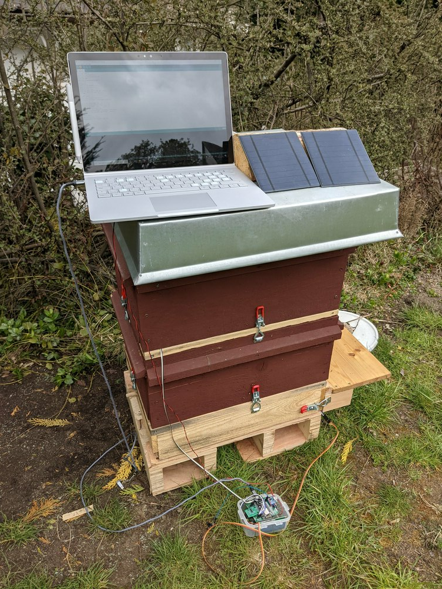
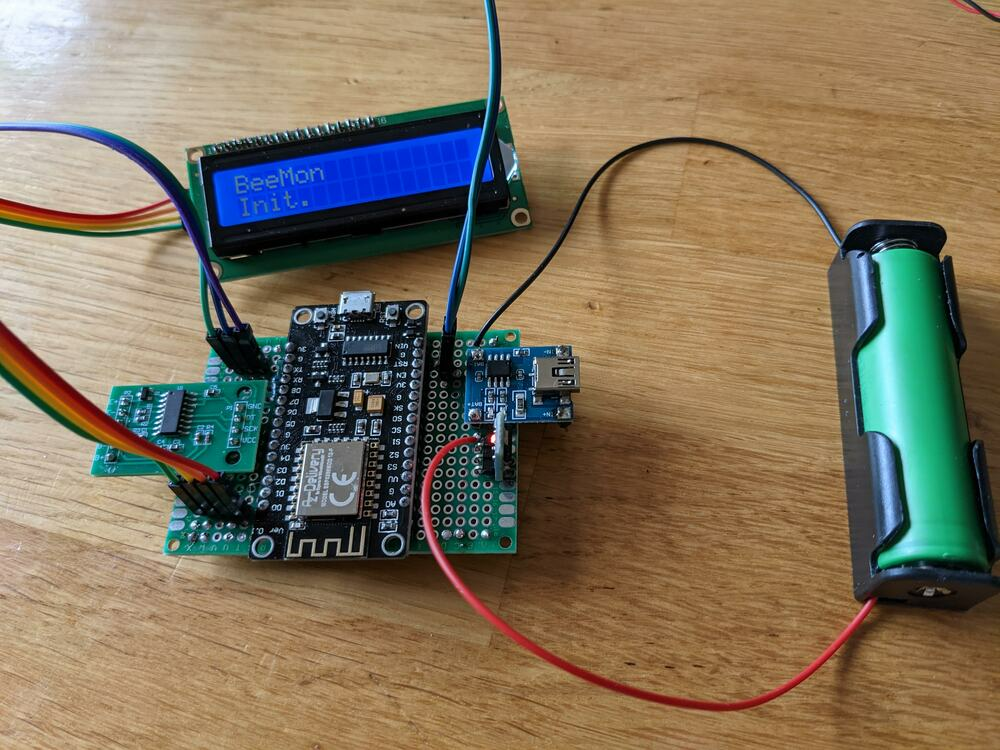
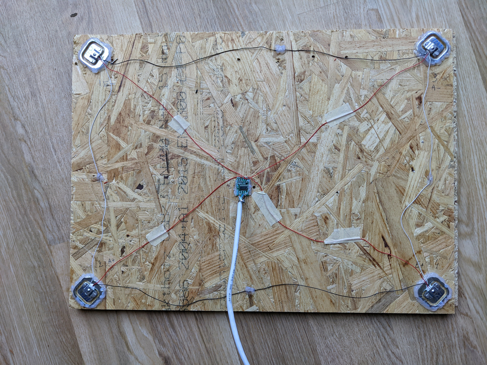

# BeeMon

This is a cheap ESP8266 beehive monitoring system. The system is powered by a solar panel charging a 18650 battery.

Monitored values are:
- Temperature and humidity using a DHT22 sensor
- Weight with an HX711 module and 4 half bridge strain gauges
- Battery level

It can send the measured values to a remote HTTP server where the data can be processed by any application. I used openhab to save and plot the measured data but any software can be used.

In order to be used without a web server in WiFi range, the measured values can also be displayed on a 2x 16 characters LCD screen connected to the ESP8266 via an I2C adapter. 

In normal mode, the system measures the data, sends them to the web server and/or LCD screen and go to deep sleep for 30 minutes. While in deep sleep, the LCD screen remains on, which of course will consume current. A switch betweek the RST pin and GND is present on the schematic. Pushing the switch will wake up the ESP8266 if it is in deep sleep mode and measure and publish the monitored values.

KiCad schematics and some custom KiCad components are included. 

## Parts list

- NodeMCU Lolin V3 or any ESP8266 module with enough digital pins
- AMS117 Step-Down Voltage regulator
- HX711 module with 4 50kg half bridge strain gauges
- DHT22 sensor
- DS18B20 sensor
- 6V / 2W solar panel
- 18650 battery with corresponding holder
- TP4056 charge controller
- HD44780 1602 2x 16 characters LCD with I2C adapter
- 1x 4.7kΩ and 1x 10kΩ resistors

The total price of the system was around 45€. Buying several items at once in order to monitor multiple hives can  further reduce the price.

## Schematics

## Realisation

The system can either be built on a breadboard or soldered on a small board. For long time use outdoor, a breadboard is probably not well-suited.

Somehow, using the ESP8266 3V pins to power the HX711 and the DHT22 doesn't work, probably because the 18650 output is not sufficient. It's better to use the AMS117 3V output for this.

The 18650 voltage is measured on the A0 pin. Either the voltage is too high for this, or it does not vary much with time, as it tends to stay on 4.4V. Adding a resistor between BAT+ and A0 may be better.

The load cells are placed in a Wheatstone bridge configuration.

Once built, the system sends logs to the serial output via the ESP8266 USB port if connected to a computer. This can be useful to check for errors.

## Configuration

- Open beemon.ino using the Arduino IDE
- In the Tools menu, set the board type according to the ESP8266 or Arduino model you are using.
- You will need the following libraries (can be added in Tools -> Manage Libraries...): LiquidCrystal, DHT Sensor Library for ESPx, LiquidCrystal I2C, HX711 Arduino Library, DallasTemperature, OneWire.
- According to your hardware and the operation mode you want, set LCD_SCREEN and WEB_SERVER to 0 or 1
- TEST_MODE can be set to 1 to update the screen and serial output every 5 seconds.

You will need to calibrate the system according to your weight sensors and construction. For this, you can compile the software in test mode and leave an heavy object whose weight is known on your load cells until the measured weight stabilizes. 
Once stabilized, you can adapt the offset (SCALE_CALIBRATION_OFFSET) and slope (SCALE_CALIBRATION_FACTOR). 

## Weight Measurements Variations

A clean positioning of the weight sensors, with cables as short as possible is primordial to get meaningful readings. My first installation was connected to the load cells cables (30-40cm) with a plug and another 60cm cable to the HX711 that was soldered to the main board, while the cables connecting the cells together were much too long and tangled.

With this configuration, I had up to 30kg variation at several moments of the day. Part of those variations were correlated to the temperature, but the baseline was too noisy to be corrected. A fifth load cell connected to the B channel of the HX711 also proved inefficient to get stable readings.

Only after fixing the cells to a rigid board and connecting them together with as short as possible cables and moving the HX711 in the middle of the cells with clean cable paths did I get a clean baseline.

In order to compensate the fluctuations correlated to the temperature (due to the [Seebeck effect](https://en.wikipedia.org/wiki/Thermoelectric_effect#Seebeck_effect)), a digital temperature sensor (DS18B20) is added to the board with a pullup resistor on its data pin.

The values in the code compensate the Seebeck effect for my board but may need adjustment depending on the build and sensor.

## LCD Display

The measured values are displayed on the LCD screen. A "w" on the top right corner means WiFi is connected. A "z" in the lowest right corner means the ESP8266 is in deep sleep mode. In this case, it can be awaken with the switch. Removing the LCD backlight jumper will reduce the current consumption but make the display difficult to read. If not soldered, the screen can be completely unplugged to reduce even further the current consumption.

## Web Server

The software uses HTTP POST to send the measured values (including raw weight sensors readings to facilitate calibration) to a web server. This assumes an HTTP server running on the same subnet with a fixed IP address. 