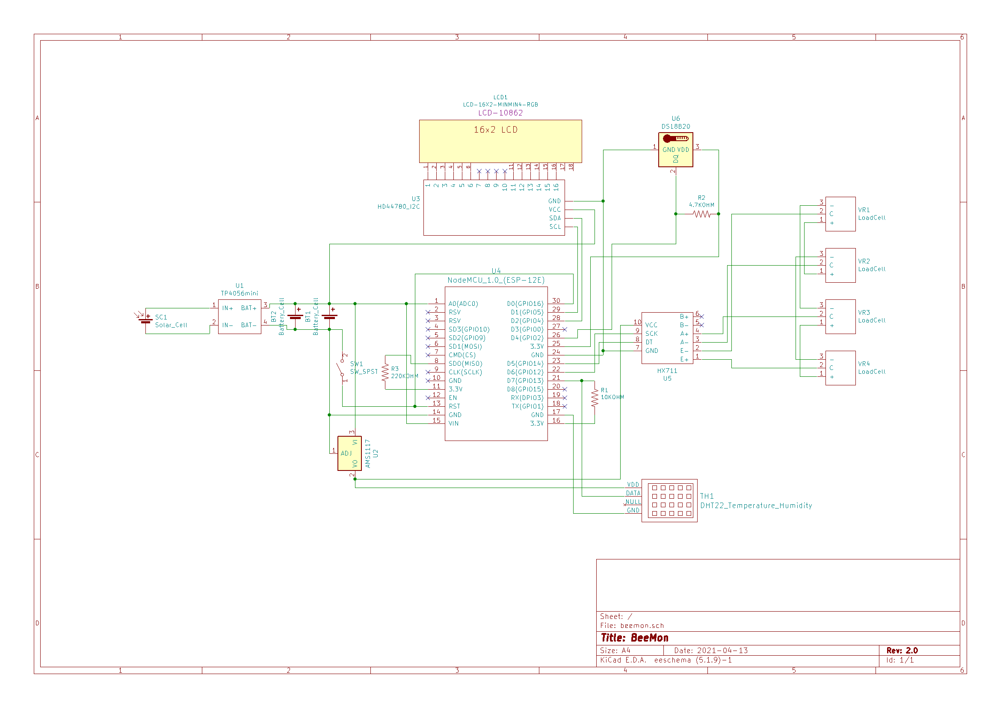

# BeeMon

This is a cheap ESP8266 beehive monitoring system. The system is powered by a solar panel charging a 18650 battery.

Monitored values are:
- Temperature and humidity using a DHT22 sensor
- Weight with an HX711 module and 4 half bridge strain gauges
- Battery level

It can send the measured values to a remote HTTP server where the data can be processed by any application. I used openhab to save and plot the measured data but any software can be used.

In order to be used without a web server in WiFi range, the measured values can also be displayed on a 2x 16 characters LCD screen connected to the ESP8266 via an I2C adapter. 

In normal mode, the system measures the data, sends them to the web server and/or LCD screen and go to deep sleep for 30 minutes. A switch controlling a pulldown resistor connected to the D0 and RST pins is present on the schematic. Pushing the switch will wake up the ESP8266 if it is in deep sleep mode and measure and publish the monitored values.

KiCad schematics and some custom KiCad components are included. 


## Configuration

- Open beemon.ino using the Arduino IDE
- In the Tools menu, set the board type according to the ESP8266 or Arduino model you are using.
- You will need the following libraries (can be added in Tools -> Manage Libraries...): LiquidCrystal, DHT Sensor Library for ESPx, LiquidCrystal I2C, HX711 Arduino Library.
- According to your hardware and the operation mode you want, set LCD_SCREEN and WEB_SERVER to 0 or 1
- TEST_MODE can be set to 1 to update the screen and/or the web server every 5 seconds.

You will need to calibrate the system according to your weight sensors and construction. For this, you can compile the software in test mode and leave an heavy object whose weight is known on your load cells until the measured weight stabilizes. 
Once stabilized, you can adapt the factor on this line:
```
scale.set_scale(-6000/0.128);
```

## Parts list

- NodeMCU Lolin V3 or any ESP8266 module with enough pins
- AMS117 Step-Down Voltage regulator
- HX711 module with 4 50kg half bridge strain gauges
- DHT22 sensor
- 6V / 2W solar panel
- 18650 battery with corresponding holder
- TP4056 charge controller
- HD44780 1602 2x 16 characters LCD with I2C adapter

The total price of the system was around 45€. Buying several items at once in order to monitor multiple hives can  further reduce the price.

## Schematics

